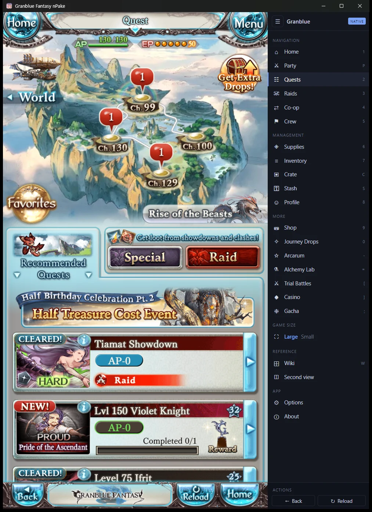
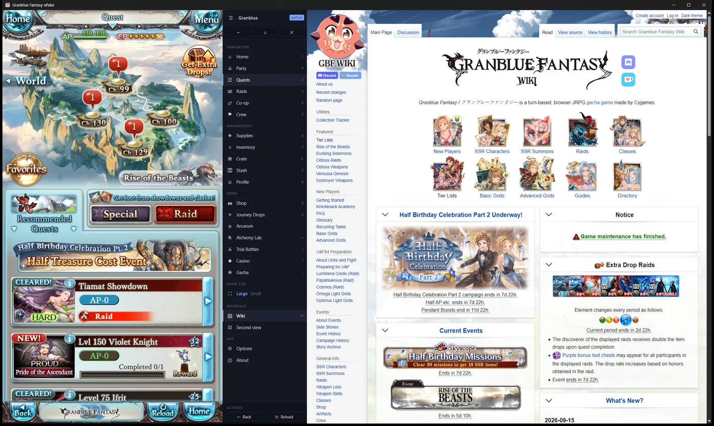
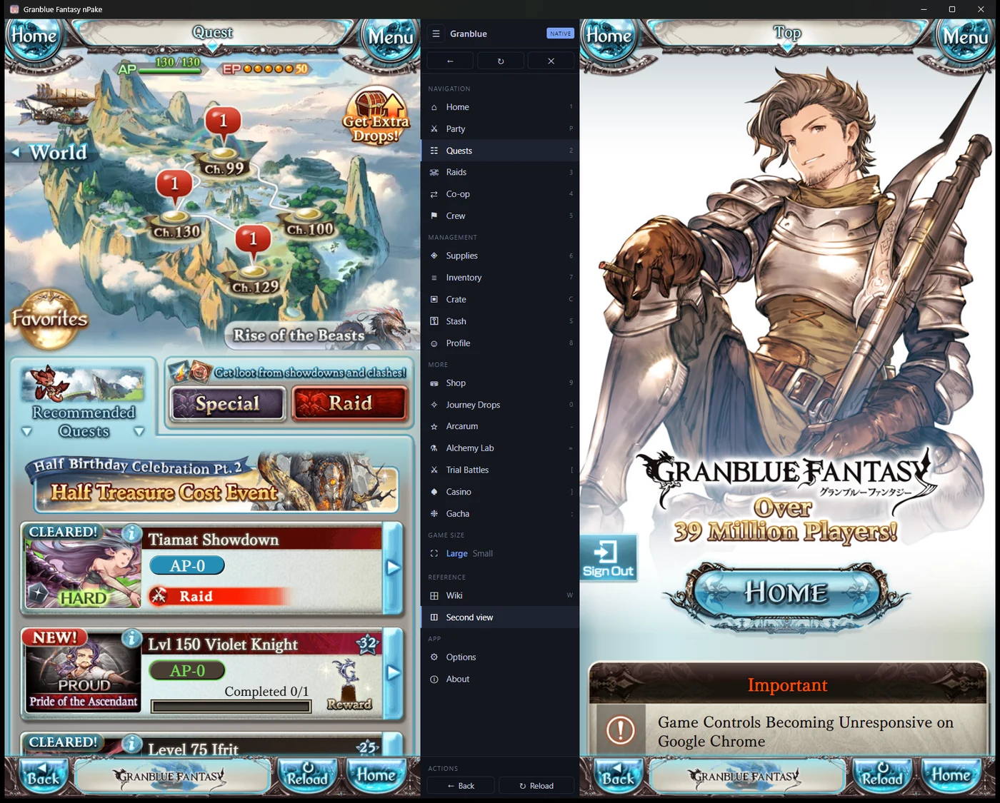
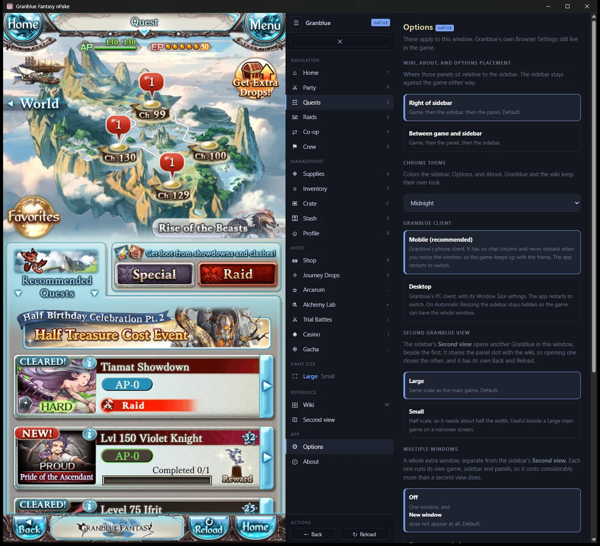
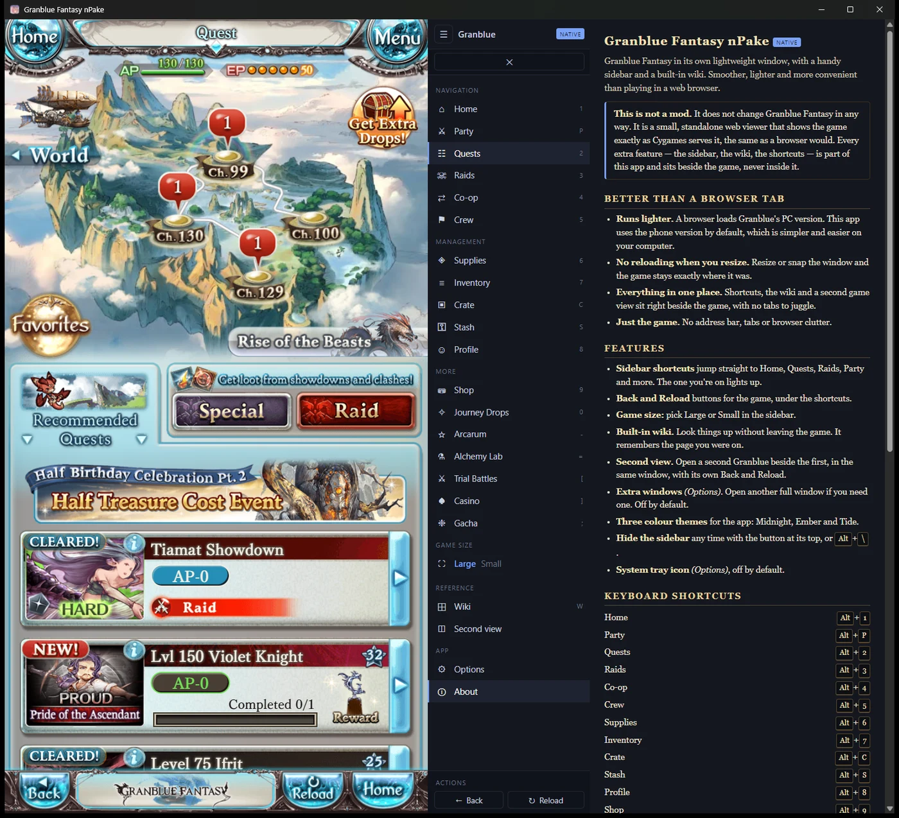

  

<h1 align="center">Granblue Fantasy nPake</h1>

  <strong>Granblue Fantasy</strong> in its own lightweight window, with a handy sidebar and a built-in wiki. 
  Smoother, lighter and more convenient than playing in a web browser.

  <a href="../../releases"><strong>Download</strong></a> ·
  <a href="https://discord.gg/grGv4Th5cE">Discord</a>

---

> **nPake 2.0 is in beta.** It replaces the 1.x "Granblue Fantasy Pake"
> releases. The old code is kept on the
> [`archive/overlay-v1`](../../tree/archive/overlay-v1) branch.

## This is not a mod

nPake **does not change Granblue Fantasy in any way.** It is a small,
standalone web viewer that shows the game exactly as Cygames serves it, the
same as a browser would. Every extra feature — the sidebar, the wiki, the
shortcuts — is part of the app and sits **beside** the game, never inside it.

- No automation, macros or bots. It never plays or clicks for you.
- It does not read your game data, and never touches your account or settings.
- Nothing is added to Granblue's page.

## Better than a browser tab

- **Runs lighter.** A browser loads Granblue's PC version. nPake uses the phone
  version by default, which is simpler and easier on your computer.
- **No reloading when you resize.** Resize or snap the window and the game
  stays exactly where it was.
- **Everything in one place.** Shortcuts, the wiki and a second game view sit
  right beside the game, with no tabs to juggle.
- **Just the game.** No address bar, tabs or browser clutter.

## Features

- **Sidebar shortcuts** to Home, Quests, Raids, Party and more, with `Alt` keys.
  The one you're on lights up.
- **Back and Reload** buttons for the game.
- **Game size:** Large or Small.
- **Built-in wiki** ([gbf.wiki](https://gbf.wiki)) that remembers where you were.
- **Second view:** a second Granblue beside the first, in the same window.
- **Extra windows** if you need them (Options, off by default).
- **Three colour themes**, a **system tray** option, drag-to-scroll, and more.

The in-app **About** page lists every shortcut.

## Screenshots

**The sidebar beside the game.** Shortcuts on the right; the one you're on
lights up. Back and Reload sit at the bottom.

**The built-in wiki**, opened beside the game without leaving it.

**Second view** — another Granblue in the same window, with its own Back and
Reload at the top of the sidebar.

**Options** and the **About** page.

## Download

Get the newest release from the [**Releases**](../../releases) page.

| Your system | Steam Granblue | Japanese Granblue |
|---|---|---|
| Windows | `...-steam-...-Windows.msi` | `...-jp-...-Windows.msi` |
| macOS | `...-steam-...-macOS.dmg` | `...-jp-...-macOS.dmg` |
| Linux | `...-steam-...-Linux.deb` / `.AppImage` | `...-jp-...-Linux.deb` / `.AppImage` |

The Steam and Japanese builds are separate apps; you can install both.

**Tested so far:** Windows with Steam Granblue. macOS, Linux and the Japanese
site are untested in this beta — reports are welcome on
[Discord](https://discord.gg/grGv4Th5cE).

### First launch

The builds are **not code-signed** (certificates cost money and this is a free
app), so your system will warn you once.

- **Windows:** SmartScreen → **More info** → **Run anyway**.
- **macOS:** if it says the app *"is damaged"*, drag it to Applications and run
  `xattr -cr "/Applications/Granblue Fantasy nPake.app"` once
  (JP build: `Granblue Fantasy nPake JP.app`).
- **Linux:** `sudo dpkg -i GranblueFantasyNPake-*.deb`, or `chmod +x` the
  `.AppImage` and run it.

## Made by

**Koine** ([AIxIOU](https://github.com/AIxIOU)). Join the
[Discord](https://discord.gg/grGv4Th5cE).

This is an **unofficial fan project**, not affiliated with or endorsed by
Cygames. Granblue Fantasy and its assets belong to their owners.

---

<strong>Technical details</strong>

- Built with [Tauri](https://tauri.app) on each system's own web engine
  (WebView2 on Windows, WKWebView on macOS, WebKitGTK on Linux), so the app is
  small.
- The game, sidebar and panels are separate views in one window; nothing is
  injected into Granblue's page. The phone version is requested the way a phone
  browser asks for it.
- Releases are built from this repository's source by
  [`GBF_Pake_Release.yaml`](.github/workflows/GBF_Pake_Release.yaml).
- To build locally: install Rust and Node/pnpm, then `pnpm install` and
  `pnpm tauri build`.

## Built on Pake

nPake is built on **[Pake](https://github.com/tw93/Pake)** by
[Tw93](https://github.com/tw93) and its
[contributors](https://github.com/tw93/Pake/graphs/contributors), which turns
websites into desktop apps with Rust and Tauri. This repository is a fork of
Pake with the Granblue app built into its source. For Pake itself, see the
[upstream repository](https://github.com/tw93/Pake); its documentation is kept
unmodified in [`docs/`](./docs).

### Licensing

Pake is licensed under **GPL-3.0-or-later** — see [LICENSE](./LICENSE). This
repository is a modified fork of Pake's source and is licensed the same way.
nPake is built from that modified source rather than by the standard Pake
packaging process, so treat the nPake app as GPL-3.0 as well; its complete
source is this repository.
