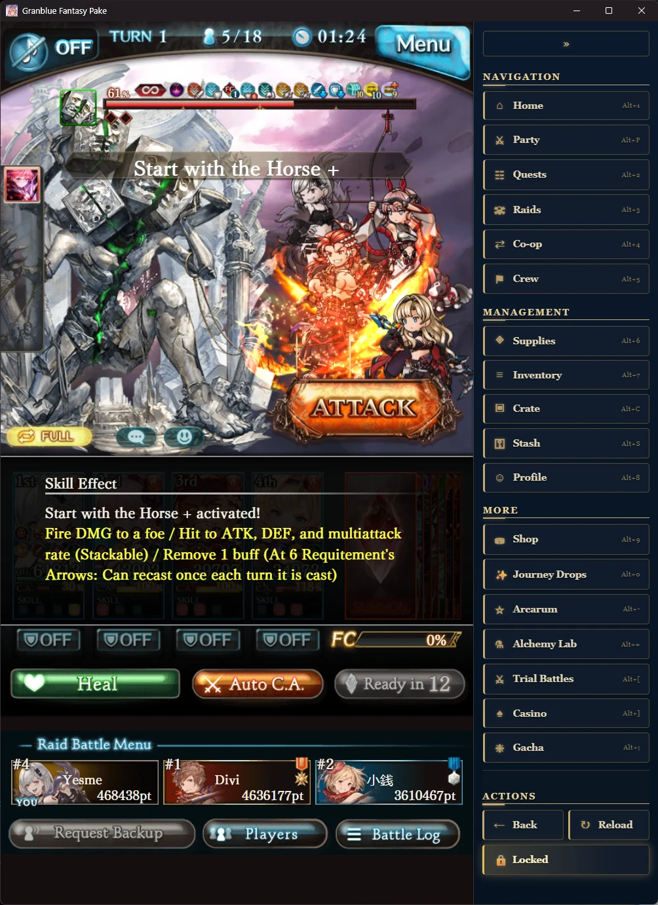
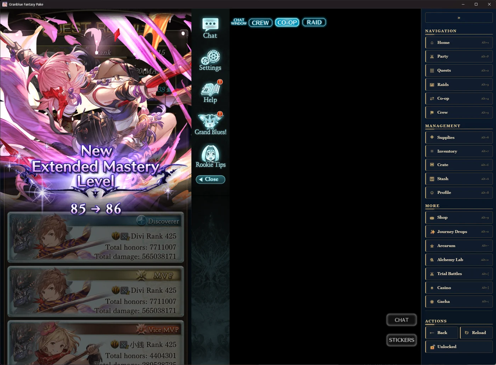
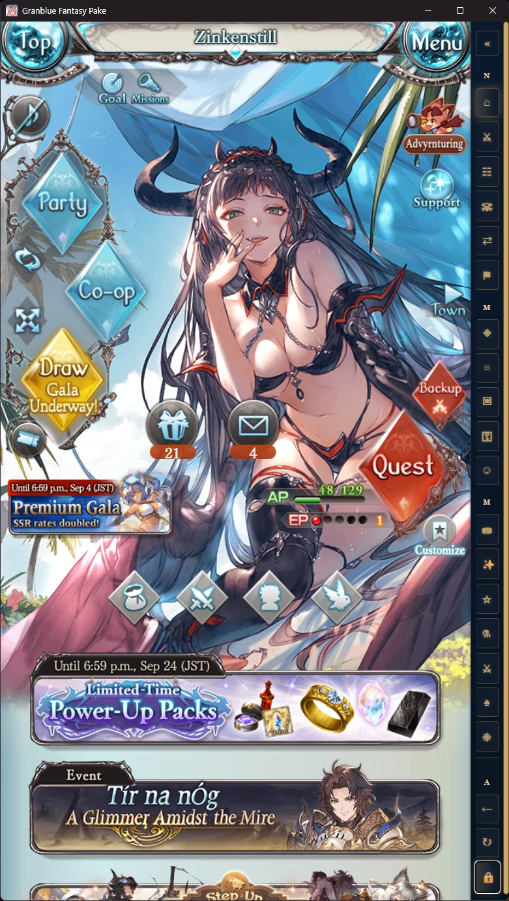
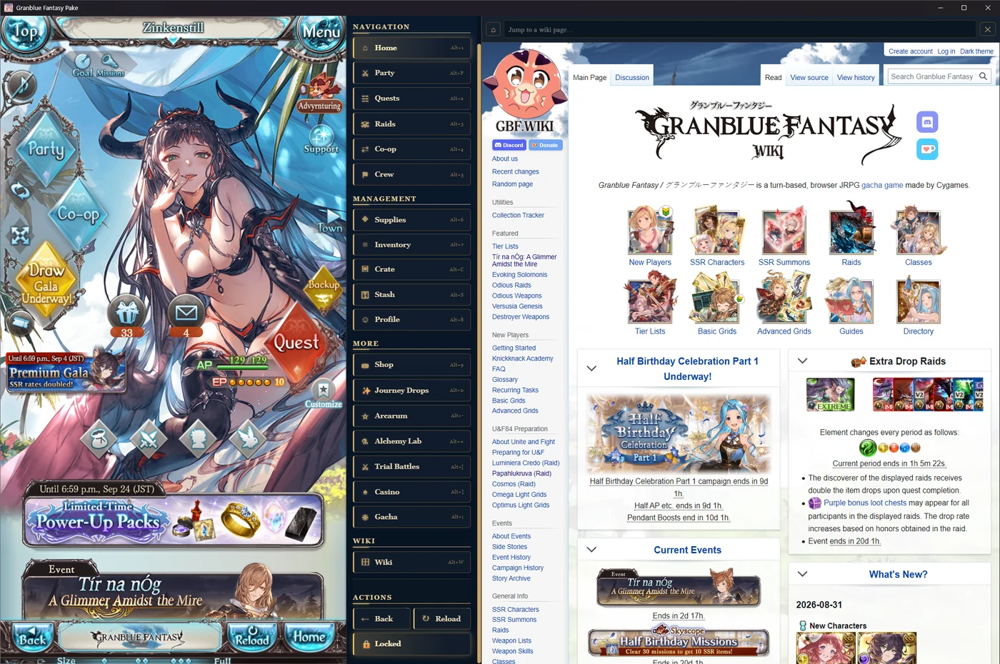

<p align="center">
  
</p>

<h1 align="center">Granblue Fantasy Pake</h1>

<p align="center">
  A lightweight desktop wrapper for <strong>Granblue Fantasy</strong>, with a navigation sidebar.<br>
  Built with <a href="https://github.com/tw93/Pake">Pake</a> (Tauri) — this repository is a fork.
</p>

---

## What this is

Granblue Fantasy runs in a browser. This packages it as a **standalone desktop application**, so it lives in its own window with its own icon and taskbar entry instead of competing with thirty other tabs.

On top of that, it injects a **sidebar** into the page: one-click navigation to the screens you actually use, with keyboard shortcuts, that stays out of the game's way.

That is the whole scope. It is a window around the website, plus a menu — see [What it deliberately does not do](#what-it-deliberately-does-not-do).

## Screenshots

**The sidebar during a raid.** Navigation, Management and More sections, each entry with its `Alt` shortcut. Back / Reload / Lock stay pinned at the bottom no matter how far the list is scrolled.



**Unlocked, on a wide window.** Granblue's own chat and help panel is allowed to appear alongside the game.



**Collapsed to icons.** On a narrow window the sidebar drops to icon-only on its own, so the game never loses space it needs. Section headings shrink to a single letter.



**The wiki open beside the game.** Pressing Wiki widens the window to the right and fills the new space with [gbf.wiki](https://gbf.wiki), so nothing is taken from the game. Closing it hands the width straight back. The panel picks the widest size that fits your screen, and there is a jump-to-page box in its header.



## Features

- **Navigation sidebar** — Home, Party, Quests, Raids, Co-op, Crew, Supplies, Inventory, Crate, Stash, Profile, Shop, Journey Drops, Arcarum, Alchemy Lab, Trial Battles, Casino, Gacha, Wiki, About.
- **Keyboard shortcuts** — every entry has an `Alt` combination, shown on the button. Plus `Alt+\` to collapse, `Alt+L` to lock, `Alt+R` to reload, `Alt+←` to go back.
- **Locked mode** — hides the game's own chat/help panel and keeps the game area compact, so it does not sprawl across a wide monitor. Toggle it off any time to get the panel back.
- **Auto-collapse** — when the window gets narrow the sidebar switches to icons by itself, and expands again once there is room.
- **Edge tracking** — the sidebar snaps to the game's real right edge as the window resizes, rather than floating at a fixed offset.
- **Drag-to-scroll with momentum** — click and drag anywhere in the sidebar, or in any scrollable part of the game, and flick to coast.
- **Wiki panel** — a slide-out panel holding [gbf.wiki](https://gbf.wiki) beside the game, with a jump-to-page box. The window widens to make room, and gives the width back when you close it.
- **About page** — an in-app reference for the shortcuts, the non-obvious behaviour, and the limitations and why they exist. `Alt+W` opens the wiki; the About entry sits below it.
- **Window fits the content** — with a fixed Granblue Window Size, the app window tracks the game plus the sidebar, so there is no dead strip beside the game and nothing is cut off when you change the game's size.
- **Multiple windows** (release builds) — open the app again and you get another window in the same app, so you can sort parties or inventory while a raid is running.
- **Faster cold loads** — preconnect and DNS-prefetch hints for the asset CDN and related hosts, applied as the very first thing on every page load.

## What it deliberately does not do

**This does not automate, assist with, or interfere with playing Granblue Fantasy.** That is a design constraint, not an oversight.

- **No automation of any kind.** No macros, no botting, no auto-battle, no scripted actions, no timers that act for you. It never clicks anything in the game on your behalf.
- **It does not read game state.** It does not scrape AP/EP, currency, inventory, drop results, or anything else out of the page. It deliberately avoids depending on Granblue's internal markup for data — partly because that would mean reading game data, and partly because the game changes that markup whenever it likes.
- **Navigation only changes the URL.** Pressing a sidebar button sets the page's hash — exactly what happens when you click through the game's own menus. It does not call the game's API and has no knowledge of any endpoint.
- **No modification of the game.** No patched files, no intercepted or rewritten network traffic, no injected gameplay behaviour. The only injection is the sidebar's own interface, plus the CSS needed to make room for it.
- **The game itself is untouched.** Granblue runs exactly as it does in a browser, at the same speed, with the same behaviour. If something breaks in-game, this wrapper is almost certainly not the cause — try the same thing in a browser to confirm.

In short: it is a window and a menu. Everything you do in the game, you do yourself.

## Supported operating systems

Platform support comes from **Pake/Tauri**, which renders through each system's own WebView instead of bundling a browser. That is why the app is small — and it is also why the requirements below are the system's rather than ours.

| OS          | Package                             | Renders with | Notes                                                                                             |
| ----------- | ----------------------------------- | ------------ | ------------------------------------------------------------------------------------------------- |
| **Windows** | `.msi`                              | WebView2     | Included in Windows 11 and current Windows 10. Older installs may need the WebView2 Runtime once. |
| **macOS**   | `.dmg`                              | WKWebView    | Intel and Apple Silicon. A universal binary can be produced with the `multi_arch` option.         |
| **Linux**   | `.deb`, `.appimage`, `.rpm`, `.zst` | WebKitGTK    | See the caveat below.                                                                             |

**Linux caveat.** Builds run on `ubuntu-24.04`, so packages expect that generation of WebKitGTK and glibc. Older distributions may refuse to install, or may launch to a blank window. Pake exposes `PAKE_LINUX_WEBKIT_SAFE_MODE` for Wayland compositors where the default rendering workarounds make input or window controls unreliable.

**Small rendering differences between platforms are expected.** Three different WebView engines means minor variation in fonts, scrollbars and animation smoothing.

## Download

Grab an installer from the [**Releases**](../../releases) page. **Take the
newest release at the top** — older ones may be marked *(superseded)* in their
title, which means a known problem was fixed in a later build.

Pick the file for your system and your region — the **Steam** and **Japanese**
builds are separate apps, so you can install both and run them at the same
time.

| Your system | Steam Granblue                          | Japanese Granblue                    |
| ----------- | --------------------------------------- | ------------------------------------ |
| Windows     | `...-steam-...-Windows.msi`             | `...-jp-...-Windows.msi`             |
| macOS       | `...-steam-...-macOS.dmg`               | `...-jp-...-macOS.dmg`               |
| Linux       | `...-steam-...-Linux.deb` / `.AppImage` | `...-jp-...-Linux.deb` / `.AppImage` |

### First launch: your system will warn you

These builds are **not code-signed**. Signing certificates cost money and this
is a free wrapper, so the warnings are expected and nothing is wrong with the
download.

**macOS** — you will see _"Granblue Fantasy Pake is damaged and can't be
opened."_ It is not damaged; macOS flags unsigned downloads. Drag the app to
Applications, then run this once:

```sh
xattr -cr "/Applications/Granblue Fantasy Pake.app"
```

(For the Japanese build, use `Granblue Fantasy Pake JP.app`.)

**Windows** — SmartScreen shows a blue warning. Click **More info** → **Run
anyway**.

**Linux** — `sudo dpkg -i GranblueFantasyPake-*.deb`, or `chmod +x` the
`.AppImage` and run it.

## Building it yourself

You do not need to — the releases above are prebuilt — but every build runs
through GitHub Actions:

1. Open the [**Build Dynamic Mobile App With Pake CLI**](../../actions/workflows/GBF_Pake_App.yaml) workflow.
2. Click **Run workflow** and pick a platform.
3. Download the artifact when the run finishes.

The defaults are already set for Granblue Fantasy. Other options include window
size, a system tray with hide-on-close, a global activation hotkey, Linux
package formats, and `debug` to enable devtools.

> **Workflow artifacts expire after a few days.** Releases do not.

## Known limitations

**Testing.** Only the **Windows** build against `steam.granbluefantasy.com` is regularly tested. Support for `game.granbluefantasy.jp` is built from real captured data but is **unverified** — treat it as untested rather than broken.

**Automatic Resizing has trade-offs the fixed sizes do not.** With Granblue's own **Automatic Resizing** turned on, the game reloads itself whenever the window is resized — so the app never resizes the window for you in that mode. Two consequences: the wiki only opens if the window is already wide enough (roughly 1690px), and the empty area beside the game cannot be reclaimed, because it is Granblue's own chat column, which locked mode hides. With a fixed **Small / Medium / Large** Window Size, neither applies: the window fits itself to the game and the wiki makes its own room.

**The wiki panel cannot be scripted from the outside.** It is an ordinary cross-origin iframe, so nothing can read its contents or know which page it is showing. That is the browser's same-origin policy, not a limitation of this app. In practice it means there is no Back button and no current-page display; Home and the search box work, and links inside the wiki open in the panel while genuinely external links open in your normal browser. Closing the panel unloads the page so it stops using memory and network, which is why it reopens at the main page rather than where you left off.

**The sidebar depends on the game's page structure for positioning.** It measures the game's container in order to place itself. That element has been stable across many Granblue updates, but a large enough layout change on the game's side could require an update here.

## Disclaimer

This is an **unofficial fan project**. It is not affiliated with, endorsed by, or connected to Cygames or the Granblue Fantasy team. Granblue Fantasy and all related assets belong to their respective owners. The screenshots above show the game purely to illustrate where the sidebar sits.

---

## Built on Pake

This repository is a **fork of [tw93/Pake](https://github.com/tw93/Pake)**, which does all of the heavy lifting. Pake turns any webpage into a desktop application using Rust and Tauri, rendering through the operating system's own WebView — which is why the resulting app is a fraction of the size of an Electron equivalent.

Everything on this page describes the Granblue Fantasy wrapper specifically. **For Pake itself — what it does, how to package any other site, the CLI, and its own documentation — go to the [upstream repository](https://github.com/tw93/Pake).** Pake's own README is not in this fork; this file replaced it, because GitHub shows only one README per repository.

Pake's documentation is still included here, unmodified:

|                                                        |                                                      |
| ------------------------------------------------------ | ---------------------------------------------------- |
| [CLI usage](./docs/cli-usage.md)                       | Every flag and option                                |
| [GitHub Actions usage](./docs/github-actions-usage.md) | Building without a local toolchain                   |
| [Advanced usage](./docs/advanced-usage.md)             | Local development and build requirements             |
| [FAQ](./docs/faq.md)                                   | Blank windows, Linux/Wayland issues, memory use      |
| [README_CN.md](./README_CN.md)                         | Pake's own README, Chinese — untouched from upstream |

### Credits

Pake is by **[Tw93](https://github.com/tw93)** and its [contributors](https://github.com/tw93/Pake/graphs/contributors). The sidebar, icon and build workflow in this fork are the only additions; everything else is upstream's work, kept deliberately close to it so the fork stays easy to update.

### Licensing

Pake is licensed under **GPL-3.0-or-later** — see [LICENSE](./LICENSE). As a fork of Pake's source, **this repository is bound by the GPLv3 too**.

Applications _built_ with Pake are treated differently. The [Pake Output Exception](./LICENSE-EXCEPTION) grants an additional permission under section 7 of the GPLv3: an app produced by the standard Pake build process is not itself made subject to the GPLv3 by the Pake parts inside it, and may be distributed under whatever terms its author chooses. In other words, a Granblue Fantasy Pake build you produce is yours; this repository is not.

Upstream also asks that anyone forking Pake into a separate product give it a different name and credit the source. This project is named **Granblue Fantasy Pake** and credits Pake above.
